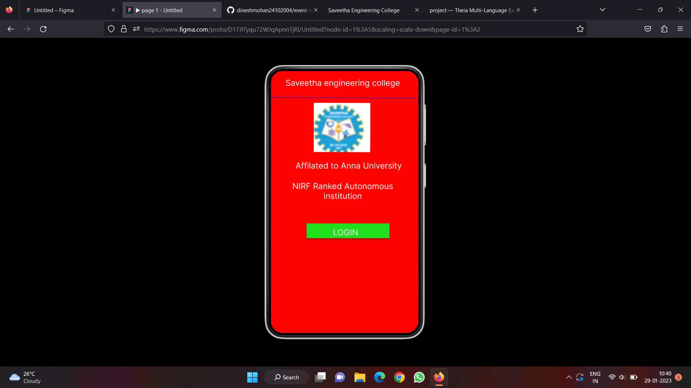
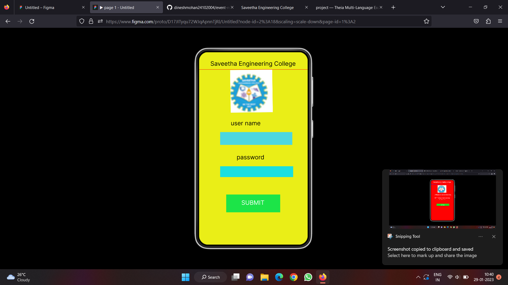
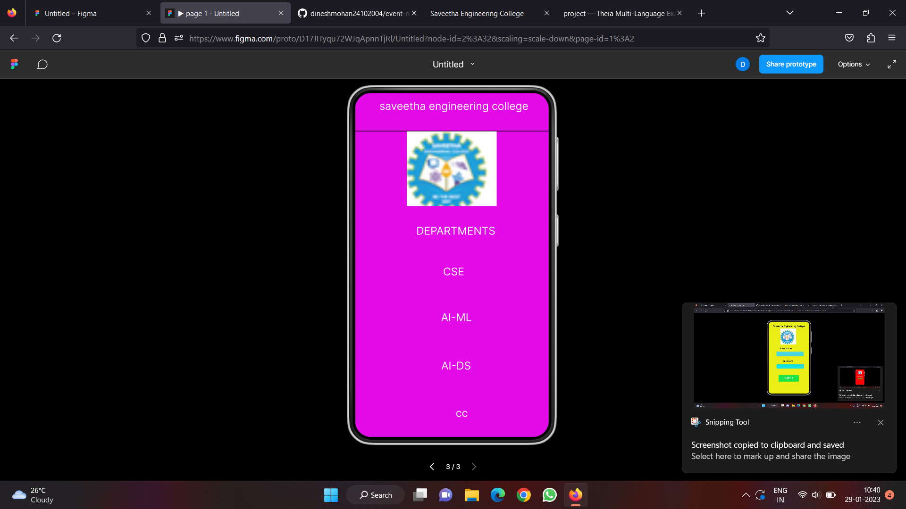

# Event Registration Web Application

## AIM:
To design, develop and deploy a web application for event registration.

## DESIGN STEPS:

### Step 1:
create a new frame.

### Step 2:
select any one present size of your registration

### Step 3:
select the shape you need

### Step 4:
import images as needed

### Step 5:
create pages based on your need and link them 
### Step 6:

Validate the HTML and CSS code.

### Step 6:

Publish the website in the given URL.

## DESIGN TOOL:
event-registration
## PROGRAM :
```
/* home page */

position: relative;
width: 360px;
height: 640px;
background: #FF0202;

/* login page */
position: relative;
width: 360px;
height: 640px;

background: #EAEE17;
box-shadow: 0px 4px 4px rgba(0, 0, 0, 0.25);


/* Rectangle 5 */
position: absolute;
visibility: hidden;
width: 309px;
height: 34px;
left: 21px;
top: 26px;

background: #D9D9D9;


/* saveetha engineering college */
position: absolute;
width: 323px;
height: 40px;
left: 22px;
top: 12px;
font-family: 'Inter';
font-style: normal;
font-weight: 400;
font-size: 20px;
line-height: 24px;
text-align: center;
color: #FFFFFF;

/* DEPARTMENTS */
position: absolute;
width: 288px;
height: 28px;
left: 43px;
top: 244px;
font-family: 'Inter';
font-style: normal;
font-weight: 400;
font-size: 20px;
line-height: 24px;
text-align: center;
color: #FFFFFF;

/* AI-ML */
position: absolute;
width: 136px;
height: 31px;
left: 120px;
top: 405px;
font-family: 'Inter';
font-style: normal;
font-weight: 400;
font-size: 20px;
line-height: 24px;
text-align: center;
color: #FFFFFF;

/* AI-DS */
position: absolute;
width: 145px;
height: 40px;
left: 115px;
top: 495px;
font-family: 'Inter';
font-style: normal;
font-weight: 400;
font-size: 20px;
line-height: 24px;
text-align: center;
color: #FFFFFF;

/* CSE */
position: absolute;
width: 146px;
height: 26px;
left: 110px;
top: 320px;
font-family: 'Inter';
font-style: normal;
font-weight: 400;
font-size: 20px;
line-height: 24px;
text-align: center;
color: #FFFFFF;

/* cc */
position: absolute;
width: 124px;
height: 29px;
left: 136px;
top: 583px;
font-family: 'Inter';
font-style: normal;
font-weight: 400;
font-size: 20px;
line-height: 24px;
text-align: center;
color: #FFFFFF;

/* Line 4 */
position: absolute;
width: 360px;
height: 0px;
left: 0px;
top: 71px;
border: 1px solid #000000;


/* saveetha logo 3 */
position: absolute;
width: 167px;
height: 139px;
left: 96px;
top: 71px;
background: url(saveetha logo.png);
```
## OUTPUT:



## Result:
the program to design,develop and deploy a web application for event registration is completed successfully.
